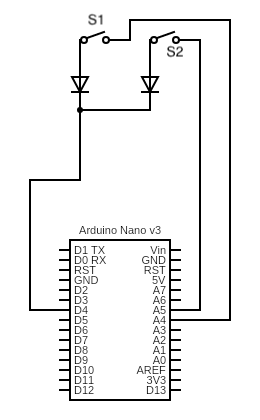
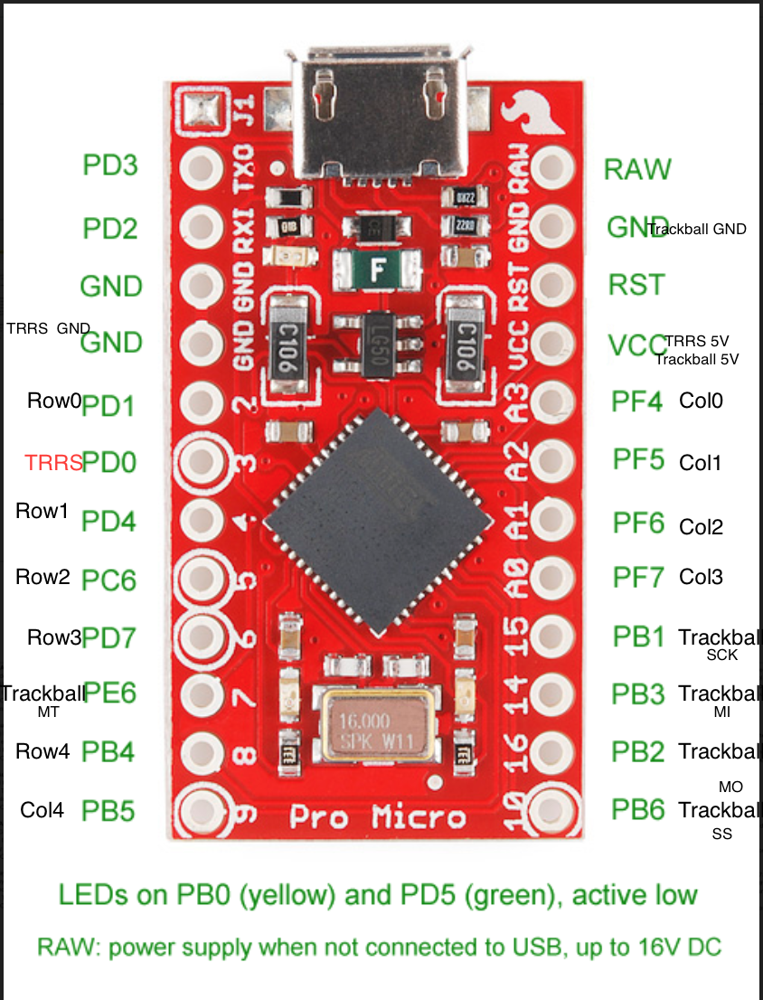
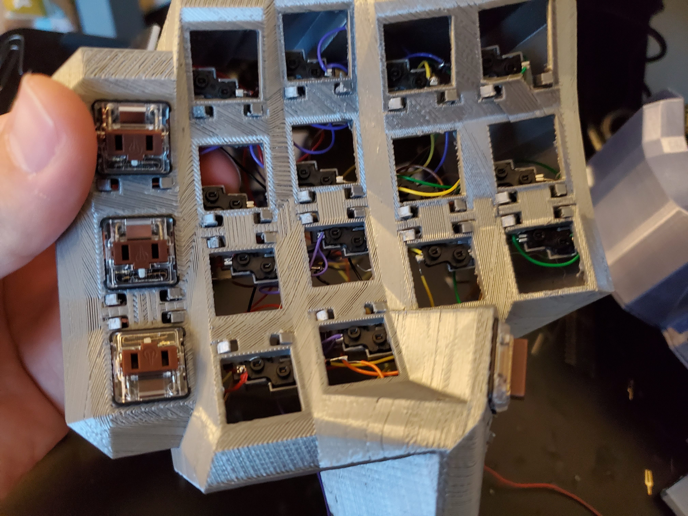

# Tractyl ManuForm Keyboard


This is a fork of [Dactyl-Manuform-Mini](https://github.com/l4u/dactyl-manuform-mini-keyboard) which itself is a fork of the [Dactyl-ManuForm](https://github.com/tshort/dactyl-keyboard), which is a fork Dactyl-Manuform is a fork of the [Dactyl](https://github.com/adereth/dactyl-keyboard) with the thumb cluster from [ManuForm](https://github.com/jeffgran/ManuForm). Fork in a fork in a fork. Forkception.

I got a lot of inspiration from [Dave Kincade's Track Beast](https://medium.com/@kincade/track-beast-build-log-a-trackball-dactyl-manuform-19eaa0880222), and also from looking at [reddit user qqurn's posts](https://www.reddit.com/user/qqurn)

For the design of the trackball mount itself, I took inspiration from [Ploopy](https://github.com/ploopyco/trackball), an open source trackball. Mainly, the idea of using 3 bearings to make the trackball move smoothly.

My goal for this keyboard was to accomplish the following features without the use of meshmixer, etc.

  * Integrated Trackball with QMK
  * Hotswappable Switches
  * Hotswappable Wiring
  * Palm Rests
  * Adjustable Tenting
  * Low Profile (doesn't have to be, if you're not into that)
  * Split
  * Ortho
  * Dished Keys
  * PBT Keycaps

Additionally, I wanted a keyboard setup that was easy to iterate on, so that I can continue to tweak it every time I get bored.

# Build Guide

This guide is split into a few main parts. These mostly follow the steps you'll take to
build this keyboard.

First, we'll start with the [parts, pricing, and general design principles](#parts). This is a good place to start
to figure out "do I actually want to build this?" and "how much will this cost me?"

Then, we'll talk about [Printing](#printing-1). This section covers how to 3D print the various pieces of this keyboard.

Next, [Soldering](#soldering)

After that, [how to use QMK](#flashing-qmk). We flash QMK before assembly so that we can test
and debug without having to disassemble and reassemble the case.

Finally, you'll [Assemble the Keyboard](#assembly). After this, you'll have a fully working Tractyl!

Optionally, you can look at [Customization](#customizing-the-keyboard) if you'd like to, for example, create a better fit for your hand.

   * [Introduction](#build-guide)
      * [Parts](#parts)
      * [Time](#time)
      * [Principles](#principles)
   * [Printing](#printing-1)
      * [Basics to Print a Model](#basics-to-print-a-model)
      * [Keyboard](#keyboard)
      * [Tent Nut](#tent-nut)
      * [Tent Foot](#tent-foot)
      * [Tent Stand](#tent-stand)
      * [Bottom Plate](#bottom-plate)
      * [Palm Rest](#palm-rest)
      * [Hotswap Socket Buckles](#hotswap-socket-buckles)
   * [Soldering](#soldering)
      * [Principles](#principles-1)
      * [Rows](#rows)
      * [Columns](#columns)
      * [Finished Product](#finished-product)
      * [TRRS](#trrs)
      * [Trackball](#trackball)
   * [Flashing QMK](#flashing-qmk)
      * [Debugging Tips](#debugging-tips)
   * [Assembly](#assembly)
      * [Sockets/Wiring](#socketswiring)
      * [Switches](#switches)
      * [Screws](#screws)
      * [Trackball](#trackball-1)
      * [Pro Micro and TRRS](#pro-micro-and-trrs)
      * [Connect Wires](#connect-wires)
      * [Keyboard and Bottom Plate Assembly](#keyboard-and-bottom-plate-assembly)
      * [Tenting](#tenting)
      * [Palm Rest](#palm-rest-1)
   * [Customizing the Keyboard](#customizing-the-keyboard)
      * [Watch out for...](#watch-out-for)
      * [Testing](#testing)
   * [License](#license)
  
**Code Warning** Hopefully you're just printing the keyboard, so you wont need to look
at it anyway; but the code I added here is pretty questionable. I'm sure I'll get around to cleaning it up eventually. 
Feel free to message me if you have any questions.

## Parts

I'm going to organize this section by parts you'll probably already have if you've been building keyboards, and parts
you'll need fresh for this one. Prices are as of writing this.

### Reusable Parts


Part | Price | Comments
-----|-------|----
[3D Printer](https://www.amazon.com/Comgrow-Creality-Printer-Upgrade-Certified/dp/B07GYRQVYV/ref=sr_1_3?dchild=1&keywords=ender+3+pro&qid=1602890672&sr=8-3) | $236 | The ender 3 pro is what I used. It's a fine 3D printer for cheap.
[Raspberry Pi](https://www.amazon.com/gp/product/B07TD43PDZ/ref=ppx_yo_dt_b_search_asin_title?ie=UTF8&psc=1) | $46.99 | Optional, you'll need it if you want octopi for the printer
[Raspberry Pi Power Supply](https://www.amazon.com/gp/product/B07Z8P61DQ/ref=ppx_yo_dt_b_search_asin_title?ie=UTF8&psc=1) | $12.74 | Optional, for octopi
[Raspberry Pi Fan Case](https://www.amazon.com/gp/product/B07V7T65BF/ref=ppx_yo_dt_b_search_asin_title?ie=UTF8&psc=1) | $6 | Optional. Because you don't want to burn your house down 
[Soldering Gun](https://www.amazon.com/gp/product/B06XZ31W3M/ref=ppx_yo_dt_b_search_asin_title?ie=UTF8&psc=1) | $17.99 | Any soldering gun will do, just needs a sharp-ish point to do small solder points
[Wire Cutter/Stripper](https://www.amazon.com/gp/product/B081821YSV/ref=ppx_yo_dt_b_search_asin_title?ie=UTF8&psc=1) | $16.99 | This one is really great for stripping the small wire just a little bit to make a solder point
[Multimeter](https://www.amazon.com/gp/product/B01N9QW620/ref=ppx_yo_dt_b_search_asin_title?ie=UTF8&psc=1) | $11.49 | Optional. But not really, it's super annoying to debug without this.
[Hot Glue Gun](https://www.amazon.com/ccbetter-Upgraded-Removable-Anti-hot-Flexible/dp/B01178RVI2/ref=sr_1_5?dchild=1&keywords=hot+glue+gun&qid=1602896601&sr=8-5) | $12.35

Total: 360.55

### Semi Reusable Parts (these will last for a bit)
Part | Price | Comments
-----|-------|----
[Solder](https://www.amazon.com/gp/product/B071G1J3W6/ref=ppx_yo_dt_b_search_asin_title?ie=UTF8&psc=1) | $8.59
[Wiring](https://www.amazon.com/gp/product/B00GWFECWO/ref=ppx_yo_dt_b_search_asin_title?ie=UTF8&psc=1) | $17.50 | BREAKS EASILY. This is what I've been using, but get something thicker (but still colorful). This stuff sucks when you're putting everything together and one snaps. Really annoying to debug too
[PLA for 3D Printer](https://www.amazon.com/gp/product/B06XSBFB17/ref=ppx_yo_dt_b_search_asin_title?ie=UTF8&psc=1) | $22.99 | BRITTLE, you should use something different. I linked the one I used for this keyboard. I've used [this one before](https://www.amazon.com/gp/product/B07PGZNM34/ref=ppx_yo_dt_b_search_asin_title?ie=UTF8&psc=1) which is ugly but holds together really well.
[Threaded Inserts](https://www.amazon.com/gp/product/B07L96KVP3/ref=ppx_yo_dt_b_search_asin_title?ie=UTF8&psc=1) | $17.92 | For the screws you'll be inserting to hold the bottom plate on
[Screws](https://www.amazon.com/gp/product/B01FTI8TM8/ref=ppx_yo_dt_b_search_asin_title?ie=UTF8&psc=1) | $7.93 | Again, for securing the bottom plate
[TRRS Jack](https://www.amazon.com/gp/product/B008SNZUYC/ref=ppx_yo_dt_b_search_asin_title?ie=UTF8&psc=1) | $8.41
[Trackball Dowels](https://www.amazon.com/gp/product/B07M63KXKS/ref=ppx_yo_dt_b_search_asin_title?ie=UTF8&psc=1) | $6.39
[Trackball Bearing](https://www.amazon.com/gp/product/B00ZHSQX42/ref=ppx_yo_dt_b_search_asin_title?ie=UTF8&psc=1) | $8.39
[Header Connectors](https://www.amazon.com/gp/product/B01MQ48T2V/ref=ppx_yo_dt_b_asin_title_o07_s00?ie=UTF8&psc=1) | $6.99 | Theses are super useful for making the motion sensor, pro micros, etc removable
[Carpet Tape](https://www.amazon.com/YYXLIFE-Tape-Double-Sided-Carpet/dp/B07H897S7R/ref=sr_1_10?dchild=1&keywords=hold+it+for+rugs&qid=1602892748&sr=8-10) | $13.97 | This seems dumb, but the 3D printed keybard will be light and slide all over the place. You'll want to put this stuff on every piece touching the desk surface

Total: $119.08 

### One Time Use

Part | Price | Comments
-----|-------|----
[Switches](https://novelkeys.xyz/products/kailh-low-profile-switches) | 5 * $6.00 | You'll need a pack of 50. Doesn't have to be choc, but I used choc brown
[Keycaps](https://mkultra.click/collections/choc/products/mbk-choc-keycaps) | ~$26 | These are really great pbt low profile keycaps. Love these things
[Diodes](https://keeb.io/products/1n4148-diodes?_pos=1&_sid=05f64b32a&_ss=r) | $2.99 | These are sold out as of writing this, may have to get them elsewhere
[TRRS Cable](https://keeb.io/products/trrs-cable?_pos=1&_sid=4a81b1f13&_ss=r) | $3.99 | 
[Pro Micro x2](https://www.amazon.com/gp/product/B07FXCTVQP/ref=ppx_yo_dt_b_search_asin_title?ie=UTF8&psc=1) | $15.99 | Trust me, you'll want the 3 pack. The usb plug tends to rip off, so be careful when unplugging/plugging back in
[Micro Usb Cable](https://www.amazon.com/gp/product/B078QHT2KY/ref=ppx_yo_dt_b_search_asin_title?ie=UTF8&psc=1) | $10.99 |
[Trackball](https://www.amazon.com/gp/product/B07BDHK2MR/ref=ppx_yo_dt_b_search_asin_title?ie=UTF8&psc=1) | $9.99
[PMW3360 Motion Sensor](https://www.tindie.com/products/jkicklighter/pmw3360-motion-sensor/) | $29.99 | Be careful with this guy, some of the soldered points come off easily
[Hotswap Sockets](https://kprepublic.com/products/kailh-hot-swapping-pcb-sockets-for-choc-kailh-low-profile-switches-for-xd75-series-smd-socket-1pcs) | 5 * $4.50 | WARNING - These can take a month or more to get to you. OPTIONAL - I made a 3d printable hot swap socket where you can shove the above header connector y piece inside. I haven't tested on a full keyboard because these finally came. But it does work, you just need to enable the `printed-hotswap? ` flag in `dactyl.clj`
  
Total: $152.44

**Total**: 632.07. Yeah, building one of these bad boys isn't cheap. But it does get better, your second one will cost 
you way less ($152.44). If you reuse parts, even cheaper. Helps me sleep at night, anyway. Plus, can you really put a price on an ergonomic keyboard with a trackball modeled to match your own hands, and the added productivity that comes with it? Yes. Yes you can. It's over $600. 

## Time

Because money isn't the only thing your spending... Here's a rough estimate of the times

##### Printing

 * Right case - 18 hours
 * Left case - 18 hours
 * Right plate - 8-12 hours*
 * Left plate - 4 hours
 * Palm rest - 3 hours
 * Tent stands and feet - 3 hours*
 * Hotswap sockets - 3 hours*

\* - I forgot

So you're looking at roughtly 60 hours of continous printing. And that's assuming you _like_ the first model that prints.

I'd suggest testing it out with switches and changing things to your liking.


##### Soldering and Assembly

I'd budget about 20 hours for each side of the keyboard. Soldering is tedious, you'll have to debug, etc. Inserting the socket buckles
is not as easy as you'd think. So 40 hours total of labor. YMMV

## Principles

**This keyboard is your endgame** (for like... 8 months) - 8 months is about the amount of time it takes to forget how painful the
soldering was the first time. You're going to want to change the shape, the switches, etc. **Lesson** - Make every part detachable
and customizable so that you can make modifications without having to resolder everything.

**3D printing is a _slow_ feedback loop** - Make and test components that are as small as possible. It's hard to get around the
large keyboard case; but you want to test things like the hotswap mounts, trackball, and palm rest separately so they
can print faster. Remember, coding is fast, printing is slow. Model and test as much as possible
before printing. An example of this is the model of my hand in `dactyl.clj`. I use that on right-test.scad to see
if things appear to be the right dimensions

**Buckles are Awesome** - Buckles secure the hotswap sockets and palm rests. They make it very easy to add and remove pieces. 3D printed screws are nice too, for the tenting.

## Printing

You'll be surprised to find that 3D printing is not like regular printing. It takes a lot of tweaking and playing with settings. Also, LEVEL YOUR BED. Always.

I'd highly recommend getting a raspberry pi and putting octopi on it. You'll up your price here by adding a $46 pi, a power supply, and maybe a $30 web cam to watch it while you're gone. But it's totally worth it.

### Basics to Print a Model

In order to print one of these, you're essentially going from clojure -> scad -> stl -> gcode. And I thought Javascript had a lot of transpiling...

You may have to install [leiningen](https://leiningen.org/)

You'll also need to setup Cura for your 3D printer. [Here's a decent guide for the Ender 3 Pro](https://all3dp.com/2/ender-3-cura-settings-best-ender-3-cura-profile/)

I'd suggest installing [octopi](https://octoprint.org/download/) so you can print things from your browser

Open your terminal and run
```bash
lein auto generate
```

This will make a bunch of `.scad` files in `things/` with the various parts.

You can open those files with [openscad](https://www.openscad.org/)

If they look correct, you render them by pressing f6. Then, click File > Export > Export as STL

Then, you'll open that file in [Cura](https://ultimaker.com/software/ultimaker-cura) and slice it. 

The main settings you need to care about are

  * **Infill** - 3D printed things are printed slightly hollow to save on plastic and print time. For testing, you want this. For the final product, it feels better at 100%
  * **Material > Printing Temperature** - Depends on your PLA, it's usually between 190-220 degrees. Experiment with what works best or print a temperature tower from thingiverse. 210 worked best for that silk PLA
  * **Speed** - Faster is going to make more mistakes. I usually leave this at 50
  * **Support** - I discuss the supports in the later sections
  * **Build Plate Adhesion** - Usually you want Skirt. It'll draw a little ring around it, which gets the plastic going. For the small pieces like the tent foot and the hotswap sockets, you want Brim. This puts a thin layer of plastic down first which helps it stick to the build plate
  

3D printed objects are strongest along the x/y axis. This is because a straight line of plastic is stronger than stacked/layered plastic that must adhere
to itself through heating. Because of this, you want to pay attention in Cura to the rotation of the object you're printing and
 the forces that will be placed on the object. I tried all sorts of temperatures, but that silk silver PLA has awful layer adhesion. 

This means when you're printing things like the tent foots, you'll want to print them sideways even though it requires extra support. Otherwise the legs
will snap when you insert the foot. If you print a buckle facing vertically, it will snap as soon as you squeeze it to insert into the snake-bite holes. 

Once you're done setting the slicing settings, click Slice in the bottom right hand corner. Then Save to File. This will save a `.gcode` file.

Now that you're done slicing, open up octopi on `http://octopi.local` and drag and drop the gcode file. Then hit the print button. You're done. But not really, keep an eye on the print and make sure it doesn't fail.
I'm a fan of [the spaghetti detective](app.thespaghettidetective.com)
 
### Keyboard

`things/right.stl` and `things/left.stl`

For the right side, you'll want to set `trackball-enabled=true` in `dactyl.clj`. This will leave a cut out for the
trackball 

You'll want to use tree supports. They're under experimental and have to be enabled in Cura, but they do a better job, are easier to remove, and take up less space. For test prints, you can use 20% infill. For the main one, I'd suggest 100% for a better feel.

### Tent Nut

This is entirely optional, but you may want to test that with your 3D printer the stand fits the nut before printing the bottom plate

### Tent Foot

`things/tent-foot`

You'll need a total of 6 of these per side if you're using the palm rest. I'd suggest using normal supports, a brim build plate adhesion, and make sure to rotate
this so that the prongs are facing on the x/y axis and not the z

### Tent Stand

`things/tent-stand`

You'll need a total of 6 of these per side if you're using the palm rest. I'd suggest using no supports. Print it with a brim, ball touching the build plate 

### Bottom Plate

`things/right-plate` and `things/left-plate`

For the right side, you'll want to set `trackball-enabled=true` in `dactyl.clj`. It'll make the holder for the trackball
on the plate. Note that this thing takes forever to render. Like 10+ minutes. That's probably because I'm not a cad engineer 
and I'm bad at this :D. I think it's mostly to do with the number of polygons it needs to render for the various circles, as well
as the hull that connects the mount cleanly to the outer shell. 

You'll want to use normal supports with this. Don't remove the supports under the trackball sensor holder. They actually help hold it in. Infill density is up to you, it doesn't matter much.

The left plate is much simpler, as it's just flat.

Do make sure you set `printed-hotswap?` based on whether you're using 3d printed hotswap sockets with header pins, or the official kailh sockets. This will affect the clearance space on the trackball mount

### Palm Rest

`things/palm-rest.stl`

Print in it's current orientation, palm rest facing up. Tree supports work well here.

### Hotswap Socket Buckles

If you're using `printed-hotswap? false`

`things/hotswap-clamp`

You'll want to right click on the model in cura and multiply it. I printed batches of 25. Note that some will probably
break while you're assembling, so print a few extra.

Helps to print these with a brim. Make sure the buckles align on the x/y axis and not the z axis, or they'll snap

With `printed-hotswap? true`:

`things/hotswap-socket` and `things/hotswap-clamp`

Make sure the buckles align on the x/y axis and not the z axis, or they'll snap.

Use needle-nosed pliers to pull the metal pin out of the female headers. Insert them into the clamp, then push the
clamp on top. This should leave two holes that the switches will fall into. You can then solder to the pins coming out
of the bottom.

## Soldering

The keyboard follows a very simple circuit. Consider the following (note this is not actually the arduino I used, but I couldn't find the pro micro on the circuit generator site):

If you have no electrical background, you can imagine the lines like a hose. The switches (s1 and s2) are like kinks 
in the hose. The neat little arrows (diodes) are like one-way valves that only let water go in one direction.

You can imagine there's water pressure (voltage) coming out at A4 and A5.



The "row" side of these switches are connected to D4. The "column" side is connected to A5 and A4.

When you press the switch down, the two pins sticking out of the switch act like a wire. So for S1, this would look like the following (where red is positive voltage):


The micro controller sees that port A4 and D4 are connected. Seeing that, it knows S1 was pressed and not S2. If S2 were pressed, it would see A5 and D4 connected, like so:


In QMK, the rows, columns, and their mapping to your keymap.c are programmed via:
 
  * [MATRIX_ROW_PINS](https://github.com/noahprince22/qmk_firmware/blob/trackball/keyboards/handwired/dactyl_manuform/4x5/config.h#L36) and [MATRIX_COl_PINS](https://github.com/noahprince22/qmk_firmware/blob/trackball/keyboards/handwired/dactyl_manuform/4x5/config.h#L39) - Listing the pins it should listen to for keypresses 
  * [LAYOUT](https://github.com/noahprince22/qmk_firmware/blob/trackball/keyboards/handwired/dactyl_manuform/4x5/4x5.h#L15) to map presses at various indices in the grid to actual keys in your keymap.c
  
My pin layout is as follows:



You can see the trackball pins here:


Row numbering is as follows:


If you're a beginner and you have never used QMK before, [QMK Configurator](https://config.qmk.fm/) is a great place to start.
This will help you fill out something akin to my [keymap.c](https://github.com/noahprince22/qmk_firmware/blob/trackball/keyboards/handwired/dactyl_manuform/4x5/keymaps/default/keymap.c). Though you'll likely want something much less complex.
Mine includes what are close to ergo-emacs keybindings, including sticky selection. I'd suggest just creating a new subdirectory under `keymaps`. Then create your own `keymap.c` and `config.h`. 

### Principles

##### Switch Rotation

With the above knowledge, it's important to note that it _does not_ matter which way your switch is rotated. Either way, clicking it down completes the circuit. This means you can have some
switches upside down as I do to hide the hotswap socket buckles on the interior.

##### Pin Location

It also _does not_ matter where you ultimately attach the rows and columns. It does not have to match my pin layout exactly if in your circumstances, different ports are more comfortable to insert. You can always fix it in the software.

##### Solder Outside the Case

While it might look fun to solder inside the keyboard case, it's a pain. You will burn the plastic. You'll have to manage weird angles. You should solder the rows and columns outside 
of the case, with detachable connectors to the trackball sensor and the pro micro. Then you can debug, make sure it's all working, then
insert the keyboard's nervous system into the case. 

### Rows

The ends of the diodes should touch forming a row. The black line on the diode should be facing away from the socket. 
I'd suggest doing this one row at a time, first soldering the diodes. Then soldering the diodes together. 

You'll want to cut the diodes short so they're not in the way.

**NOTE**: Don't use more solder than you need on the socket, it will make it difficult to insert into the socket buckles later on.


Then, you'll want to use the wire stripper to create a wire with strips for where the diodes will connect.

The start of that wire should connect to a header pin, like so


**NOTE**: Give yourself more room than you think you need on these wires. If you make it too small, you'll have to break the wire and resolder. 
If you make it a little bigger, it'll still fit in the case so no harm done. Also, remember to consider where this wire will be in the actual case. If it's going to end in the thumb cluster, you'll need more lead.

**NOTE**: Unlike the following picture, you should have the end of the wire have an extra lead and connect to a header pin. That way you don't have to 
solder an extra wire to the row to connect it to the Pro Micro. I didn't do this on the right half while taking pictures, but it made the left half easier.


It can help to use aligator clips to hold things in place when you're soldering the rows together:


Once you're done, it'll look like this (except with header pins connected. Do not forget to do this):


### Columns

The columns are much the same as the rows. 
Remember to consider where this wire will be in the actual case. If it's going to end in the thumb cluster, you'll need more lead.
It's easier if you slide the wire through the slits in the sockets:


You'll want each column to go to a header pin. Pay attention to the layout here:


This is aligned how it will go into the keyboard

### Finished Product

When you're done, you'll have a nice rats nest like this:


You should take this opportunity to flash your pro micro and test each of the sockets by inserting a switch and testing that the key shows up. See [Flashing QMK](#Flashing QMK)

### TRRS

I don't have images for this. But the TRRS connector has no particular ports, you just _must_ match the left side to the right side.

So if you solder VCC, GND, SIGNAL to bottom left, bottom right, top respectively; you must do the same on the other side. There's one signal wire for the TRRS cable that goes to PD0 on both micro controllers.
The other two ports are for VCC and GND.

### Trackball

You'll want to use header pins so you can easily disconnect wires from the pro micro and the trackball respectively. Solder
the female header pins in such a way that it will fit in the case. I had them coming out the back of the sensor. 

You can see the trackball pins here:


Match them up to the pins here:


You can see [My QMK on branch trackball](https://github.com/noahprince22/qmk_firmware/tree/trackball/keyboards/handwired/dactyl_manuform/4x5/pmw3360) for how the trackball is hooked up.

[This diff shows my additions](https://github.com/noahprince22/qmk_firmware/compare/noah...noahprince22:trackball)


## Flashing QMK

I never bothered to figure out how to make QMK be able to use either side of the keyboard. I just use the right side as my main. 

To flash the full keyboard, you'll want to (assuming your keymap name is `default`)

  1. Set [MASTER_LEFT](https://github.com/noahprince22/qmk_firmware/blob/trackball/keyboards/handwired/dactyl_manuform/4x5/keymaps/default/config.h#L31) and unset MASTER_RIGHT (comment it out)
  2. Open a terminal. From `qmk_firmware/` run `make handwired/dactyl_manuform/4x5:default:avrdude`
  3. Connect the RST and GND when prompted to reset. Your keymap should include REST key so you don't have to do this by manually attaching wires once you've flashed. I put it on a layer
  4. Set [MASTER_RIGHT](https://github.com/noahprince22/qmk_firmware/blob/trackball/keyboards/handwired/dactyl_manuform/4x5/keymaps/default/config.h#L31)
  5. Connect the micro usb cable to the arduino pro micro and connect the TRRS cables bewteen left and right sides
  6. Open a terminal. From `qmk_firmware/` run `make handwired/dactyl_manuform/4x5:default:avrdude`
  7. Connect the RST and GND when prompted to reset. Your keymap should include REST key so you don't have to do this by manually attaching wires once you've flashed. I put it on a layer
  
You only need to do the left or right steps to debug your wiring. It's important that the left side has been flashed at least once
so that it will take the right's lead when TRRS cables are connected and we flash.

### Debugging Tips

You can usually identify where the issue is in your wiring by figuring out which keys don't work.

If an entire row doesn't work, then it's likely the connection issue is on the wire to the arduino.

Same goes for an entire column.

If just one key is failing, it's likely that key's connection to the row or column.

Sometimes you may have a row partially work. Then, the issue is likely in the connection between the last working key and the dead key.

Sometimes, you'll have one key initiate two key presses. This means wires are touching somewhere. A lot of times this can happen where they're plugged into the pro micro

If all else fails, remember the software itself could have a bad keymap. This is where you can use the Multimeter. You'll
want to check voltage and place one lead on one side of the switch, one lead on the other. If you see a voltage change when
you press the switch, there's a good chance it's working and your code is just broken. 

Finally, take a deep breath. Walk away. Come back to it later. A keyboard like this isn't a weekend project. The lead times
on receiving parts from the various stores alone will extend it out to a month. Take your time, don't get too frustrated, and enjoy the hobby!
  

## Assembly

### Sockets/Wiring

Place each socket in each row onto a socket insert buckle and push it through the snake-bite holes on each key. It should look like this:



### Switches

Insert the switches before attaching the bottom. You should hold your finger on the bottom of the socket
while inserting the switch, as it will make a better connection. You _can_ switch them out with the case assembled,
but you do risk a weaker connection as sometimes the buckles shift backward.

### Screws

One at a time, put a little hot glue in the threaded insert holes on the bottom of the keyboard, then insert a M2 x 4mm x 3.5mm 
threaded insert. Make sure to push them in all the way (x5)


### Trackball

Slide the trackball sensor into the slot


Slide the trackball dowel into the bearing such that the bearing is half way down the dowel (x3). Insert these into the trackball housing so they snap in place.
It's easiest to insert using needle-nose pliers 

These are what allow the trackball to move on all axes. You should spin these to make sure they rotate freely. If they do not, you may need to wiggle a screw driver
or pliers inside the hole to open it up a bit.


You should insert the trackball into the housing and make sure it rotates freely. You should also connect the sensor
to the pro micro and test that the trackball is functioning before fully assembling the keyboard.

### Pro Micro and TRRS

Hot glue the Pro Micro and TRRS Jack in place


### Connect Wires

Connect the header pins to the female header slots. Start with the trackball, making sure it works.

After that, insert the rows/columns into the pro micro.

### Keyboard and Bottom Plate Assembly

Insert the top of the case with the switches onto the bottom plate, pushing down until it slides into place.

Note that one key above the trackball may be pushed up a bit. I didn't leave enough clearance, so it's not a perfect fit.

Once the case is snug, use the m2 screws to secure it in place.

### Tenting

Screw the tent stand as far as desired into the case. Put some carpet tape on the bottom of the tent foot. 
Snap it into place like so (x2):


### Palm Rest

Screw a tent stand into the palm rest. Put some carpet tape on the bottom of a tent foot. Insert the palm rest using the buckle into
the back of the keyboard. Insert the tent stand into the tent foot. 

You should adjust the screws of all the tent stands and palm rests such that the keyboard doesn't shift/rock around.

You may also want to put some carpet tape on the outside edge of the keyboard to prevent sliding.

## Customizing the Keyboard

The whole fun of having a 3D printer, and a keyboard with removable _everything_ is that you can customize to your heart's
content. To get started:

* Run `lein generate` or `lein auto generate`
* This will regenerate the `things/*.scad` files
* Use OpenSCAD to open a `.scad` file.
* Make changes to design, repeat `load-file`, OpenSCAD will watch for changes and rerender.
* When done, use OpenSCAD to export STL files

You'll have to learn openscad, and a bit of clojure. I'll leave that as an exercise to the reader

### Watch out for...

When you're editing the keyboard, whether it's to add more keys -- keep the following in mind:

#### Screw Holes

When you change the shape of the keyboard, _inevitably_ the bottom screw holes that secure the bottom plate
to the keyboard get messed up. You want these to always be touching the keyboard, or they'll just be printed floating in
the middle somewhere and won't do you any good.

#### Tent Holes

You'll want to make sure the holes for the tenting are in an appropriate place. I find it's the most stable
the further they are toward the edge of the case

#### Palm Rest Holes

These aren't always an issue, but you'll want to make sure they're still in the right place, the hole goes all the way through, etc.

### Testing

`things/right-test.scad` is incredibly useful. In addition to showing you where the keys will be,
I've also included a model of my hand to show how it will fit into the layout.

You can, and should change the dimensions of that hand to match your own. The measurements sent to the function `finger`
are the length (in millimeters) between

  1. Tip of finger to first joint
  2. First joint to second joint
  3. Second joint to third joint
  4. Radius of your finger
  
These measurements are, of course, approximate and the model isn't perfect. After your first test print,
you can calibrate the measurements and push them around to match what your experience was in the real world.

This ends up being incredibly useful to ensure the trackball is in a comfortable position, as well as the keys being comfortable
to press.

# License

Copyright © 2015-2020 Matthew Adereth, Tom Short, Leo Lou and Noah Prince

The source code for generating the models is distributed under the [GNU AFFERO GENERAL PUBLIC LICENSE Version 3](LICENSE).

The generated models are distributed under the [Creative Commons Attribution-ShareAlike 4.0 International (CC BY-SA 4.0)](LICENSE-models).
